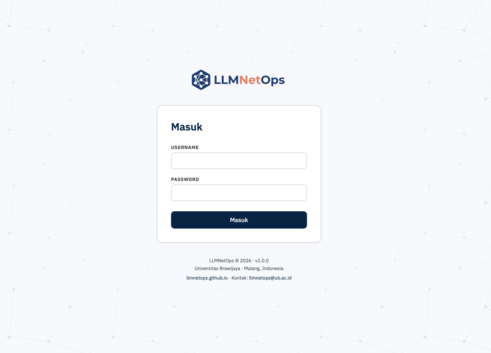
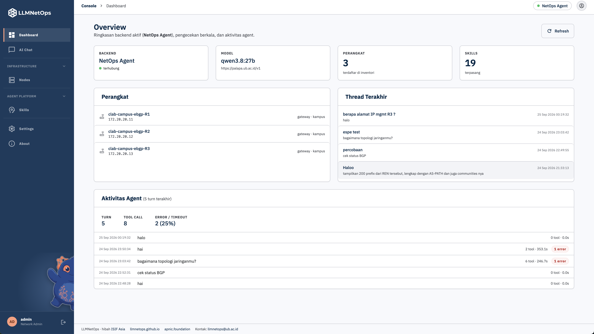

<p align="center">
  
</p>

# NetOpsUI — LLMNetOps Console

Web console untuk operasional jaringan berbasis agent AI. NetOpsUI **tidak menjalankan agent**: chat dan tool jaringan dikerjakan oleh salah satu dari dua backend, sedangkan NetOpsUI menyediakan antarmukanya.

| Backend | Keterangan | Alamat default |
|---|---|---|
| **NetOps Agent** | REST API agent jaringan (repo `palapa-agent`) | `127.0.0.1:8100` |
| **Hermes Agent** | Gateway Hermes, platform `api_server` | `127.0.0.1:8642` |

Hanya satu backend aktif pada satu waktu, dipilih di **Settings**.

## Fitur

- **Dashboard**: status backend, model, skill, thread terakhir. Hermes menampilkan pengecekan berkala (cron job); NetOps Agent menampilkan perangkat dan aktivitas agent.
- **AI Chat**: percakapan dengan agent, dengan panel aktivitas tool dan riwayat thread.
- **Nodes**: daftar dan pendaftaran perangkat jaringan (NetOps Agent).
- **Skills** dan **Agents**: kelola skill dan profil agent, lalu publish ke backend.
- **Settings**: pilih backend, kelola LLM provider, lihat file konfigurasi, ganti password.

## Tampilan

Halaman login:



Dashboard setelah login berhasil:



## Sebelum digunakan

### Prasyarat

- Docker Engine + Compose v2 (`docker compose version`).
- Host **Linux**. Container memakai `network_mode: host`, jadi tidak berfungsi di Docker Desktop macOS/Windows.
- Minimal satu backend (NetOps Agent atau Hermes) terpasang di host yang sama.
- Port kosong: UI `3000`, manager `8200`, NetOps Agent `8100`, Hermes `8642` (bisa diubah di `.env`).

### 1. Jalankan backend

**NetOps Agent:**

```bash
cd /path/ke/palapa-agent
PALAPA_CONFIG_PATH=$HOME/.palapa/config.yaml \
  uv run uvicorn palapa.gateway.api:app --host 127.0.0.1 --port 8100
```

**Hermes:** tambahkan ke `~/.hermes/.env`, lalu restart gateway Hermes.

```bash
API_SERVER_KEY=<key-acak-yang-kuat>      # mis. hasil: openssl rand -hex 32
```

Cek backend sebelum lanjut:

```bash
curl -s localhost:8100/health     # NetOps Agent
curl -s localhost:8642/health     # Hermes
```

### 2. Konfigurasi

```bash
git clone https://github.com/LLMNetOps/NetOpsUI.git NetOpsUI && cd NetOpsUI
git checkout ui
cp .env.example .env
$EDITOR .env
```

Yang wajib diperiksa di `.env`:

| Variabel | Isi |
|---|---|
| `NETOPS_AGENT_HOME` | Folder home NetOps Agent, mis. `/home/<user>/.palapa` |
| `HERMES_HOME` | Folder home Hermes, mis. `/home/<user>/.hermes` |
| `HOST_UID` / `HOST_GID` | Hasil `id -u` dan `id -g` |
| `NETOPS_AGENT_URL`, `HERMES_URL` | Ubah hanya jika port backend berbeda dari default |

Pastikan file berikut **sudah ada** di host (jika tidak, Docker membuatnya sebagai folder dan mount gagal):
`$NETOPS_AGENT_HOME/{SOUL.md,config.yaml,.env}` dan `$HERMES_HOME/{SOUL.md,config.yaml,.env}`.
Folder `data/` ikut di repo dan harus dimiliki user Anda, bukan `root`.

### 3. Build dan jalankan

```bash
docker compose up -d --build
docker compose ps          # kedua service harus "healthy"
```

### 4. Buat user pertama

UI meminta login dan tidak ada halaman pendaftaran, jadi buat user lewat CLI:

```bash
docker compose exec manager python create_user.py admin
```

Password minimal 10 karakter. Perintah yang sama dengan username yang sudah ada akan **mereset password** user itu.

### 5. Buka UI

Buka `http://<host>:3000` dan login. Pilih backend di **Settings → Backend**.

Jika memakai Hermes: di **Settings → Backend**, tempel `API_SERVER_KEY` pada kartu Hermes, klik **Cek**, lalu **Simpan**. Key disimpan di database NetOpsUI, bukan di `.env`.

## Catatan

- Tanpa HTTPS, password dan cookie login lewat jaringan sebagai teks biasa. Untuk akses selain localhost, pasang TLS (reverse proxy) atau VPN di depan port `3000`.
- Semua credential (API key Hermes dan provider LLM) ada di `data/netopsui.db`. Batasi akses ke folder `data/` dan cadangannya.
- Update: `git pull && docker compose up -d --build` (data di `data/` tetap ada).
- Mode development (hot reload): `docker compose -f docker-compose.yml -f docker-compose.dev.yml up -d`.
- Detail teknis dan aturan pengembangan ada di [CLAUDE.md](CLAUDE.md).
